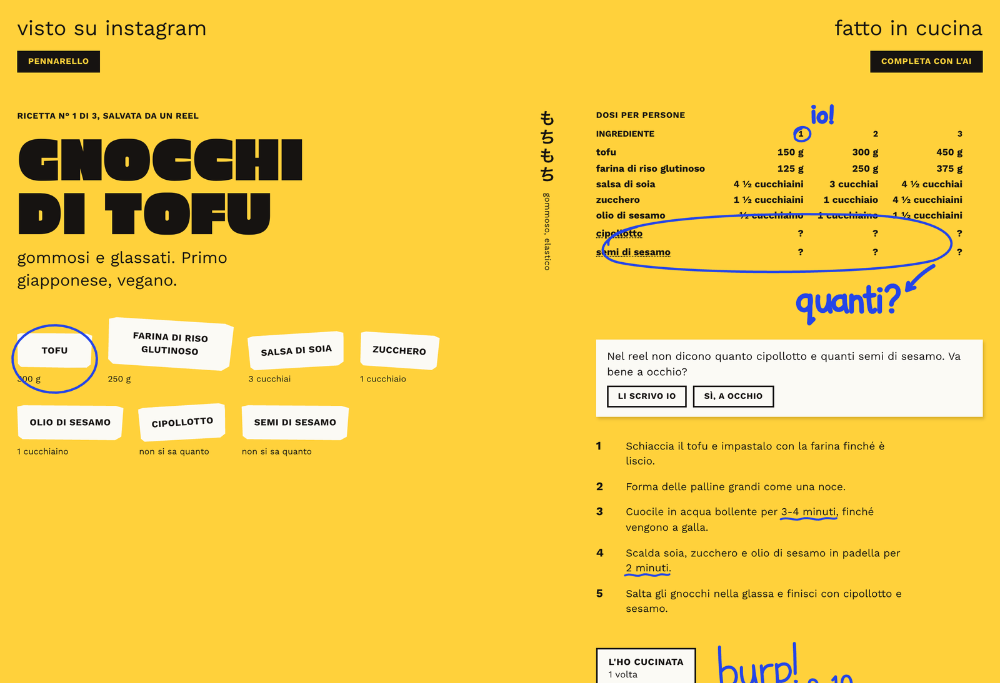
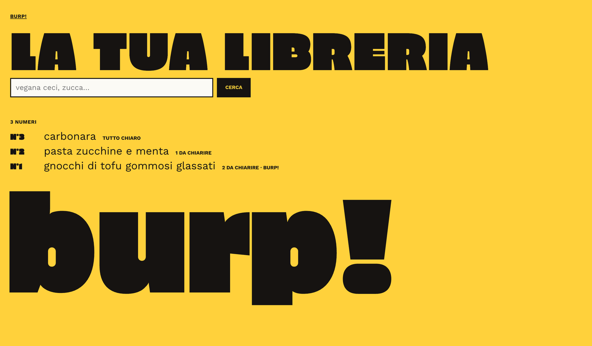
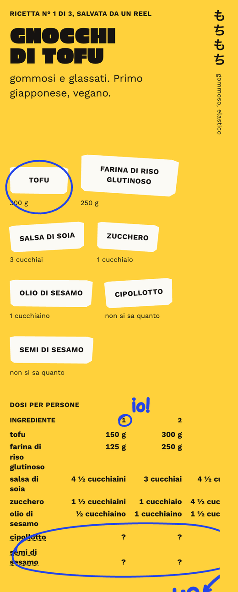
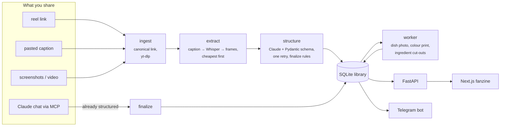

# burp!

[](https://github.com/Priestomm/burp/actions/workflows/ci.yml)

**burp! turns the Instagram cooking reels you save into recipes you can actually cook from.** Share a reel with a Telegram bot, or ask Claude to save a recipe it wrote for you, and it lands in a personal library: ingredients with quantities, steps, portions, and a page that looks like a photocopied fanzine.

Reels are a terrible recipe format. Half of them say "recipe in the video", the quantities are spoken once over music, and the steps are a caption cut off after three lines. burp! reads the caption, then the audio, then the frames, until it has a recipe, and it tells you plainly what the reel never said instead of making it up.



<table><tr>
<td width="62%"></td>
<td></td>
</tr></table>

<sub>Screenshots from a demo library with recipes written for it. The interface is in Italian; the code, the comments and this README are in English.</sub>

## What it does

- **Imports a reel from a link, a pasted caption, screenshots or a screen recording**, through a Telegram bot or the command line.
- **Structures it with Claude** into a validated recipe, then checks the answer with deterministic rules: an ingredient without a quantity makes the recipe "partial", a dish with anchovies can never be filed as vegan.
- **Shows it as a fanzine page** (Next.js): the dish printed in colour on torn paper, ingredients cut out with scissors, a dose table for 1, 2, 3… people, and blue marker notes drawn from the data: "io!" over the one-person column, a ring and "quanti?" around the missing quantities, a squiggle under times and temperatures.
- **Fills the gaps on request**: "completa con l'AI" estimates what the reel didn't say, kept apart from what it did, and your own corrections always win.
- **Has a freehand marker**: draw on the page with a finger or a pen; each stroke sticks to what you drew it on.
- **Talks to Claude over MCP**: from any chat, on the phone too, "save it in burp!" stores the recipe Claude just wrote, and Claude can search your library.

## How it works



| Stage | File | What it does |
| --- | --- | --- |
| Ingest | `burp/ingest.py` | Normalises the link (`/reels/` → `/reel/`, no `?igsh=`), so the same post shared twice is found **before** anything is downloaded or paid for. |
| Extract | `burp/extract.py` | Caption, then the audio transcribed locally with faster-whisper, then six video frames read by Claude. Each source is used only if the previous one wasn't enough. |
| Structure | `burp/structure.py` | Claude fills the `Recipe` schema (`burp/models.py`); invalid output is retried once with the validation error pasted back; `finalize` applies the rules that must not depend on the model. |
| Library | `burp/library.py` | SQLite with migrations (`PRAGMA user_version`), search by title, tag and ingredient, the job queue, the drawings. |
| Worker | `burp/worker.py` | Background jobs, so a reply never waits for pictures: picks the dish frame, prints it, cuts out the dish and the ingredients. |
| Web | `web/` | Next.js 16 App Router with Server Components and Server Actions; the browser never talks to Python directly. |
| MCP | `burp/mcp_server.py` | Three tools for Claude, and a one-person OAuth server so Claude can sign in from Anthropic's cloud. |

## Decisions worth explaining

**Deterministic code where it is enough, the model only where it is needed.** Whether a caption "is a recipe" is decided by regular expressions, not by a model call: at least 25 words, some quantities, and steps (a heading, or two different cooking verbs matched as stem plus ending, so *taglia* counts and *tagliatelle* doesn't). It is free, instant and predictable, and it runs on every import. The model is called once to structure the text.

**The schema is the contract.** The Pydantic models are at once the Python types, the JSON schema the API forces Claude to fill (structured outputs) and part of the prompt, through their field descriptions. Pydantic then rejects what the schema can't express, like a quantity of zero.

**The model proposes, the code checks.** `finalize` maps ingredient names to a canonical catalogue (*pomodori*, *tomatoes* and *pomodoro* become one), marks a recipe `partial` whenever a quantity or the steps are missing even if the model said `complete`, and never lets the diet be more permissive than the known ingredients allow. So the honest answer to "how do you handle hallucinations?" is in three layers: the schema constrains the shape, validation rejects impossible values, and plain code re-checks what matters.

**Cost is a design constraint.** A duplicate link is caught before downloading; the system prompt and the catalogue are prompt-cached; transcription runs locally; the small jobs (splitting titles, choosing a frame, filling gaps, choosing ingredient pictures) go to Claude Haiku at low effort, and estimates are cached, so showing them again costs nothing. A recipe written in a Claude chat is saved already structured, with no model call at all.

**Never generated images.** The dish photo is a frame of the reel or a picture you send, chosen by a vision model for being the most appetising; ingredient pictures come from Open Food Facts (CC BY-SA, credited on the page) and Pexels. Unsplash is not used because its terms require hotlinking unmodified images. With no good picture the page shows a blank sheet or a paper slip with the name.

**Respecting Instagram and the creators.** burp! processes only what you share, one link at a time, with no scraping. Taking the dish photo from the reel itself is off by default (`BURP_PHOTO_FROM_REEL`): it extends a download Instagram's terms forbid, and the frame is the creator's image, fine in a private library but not in a public app.

**Marker strokes that survive a different screen.** A stroke is stored as an SVG path in thousandths of the width of the element under its middle (the photo, an ingredient, a step), on both axes. On a phone, where the text wraps differently, a ring drawn around the tofu on a laptop is still around the tofu. The drawing is saved whole after every stroke, so undo is just one stroke less.

**An OAuth server for one person.** Claude connects to MCP servers from Anthropic's cloud and signs in with OAuth. burp! implements the authorization server itself (dynamic client registration, PKCE, refresh-token rotation), with a password page instead of user accounts, and keeps tokens hashed in SQLite so a restart doesn't sign Claude out. No tool can delete anything.

## Stack

Python 3.13 with [uv](https://docs.astral.sh/uv/), the Anthropic SDK, Pydantic, FastAPI, SQLite, the MCP Python SDK, faster-whisper, PyAV, yt-dlp, rembg, numpy and Pillow · TypeScript, Next.js 16, React 19, CSS Modules, types generated from the API's OpenAPI schema · pytest, ruff, vitest, ESLint, GitHub Actions.

## Run it

```sh
uv sync --extra media --extra cutout    # media: links, transcription, frames · cutout: local background removal
cp .env.example .env                    # then set ANTHROPIC_API_KEY (and the Telegram ones for the bot)
(cd web && pnpm install)
uv run burp dev                         # API, bot, web app (and MCP, if configured) in one terminal
```

`uv run burp dev` checks that its ports are free, prefixes each log line with `[api]`, `[bot]`, `[web]` or `[mcp]`, and stops everything on Ctrl+C or when one of them stops. The web app is on http://localhost:3000. Without the extras, pasted captions and screenshots still work.

| Variable | Purpose |
| --- | --- |
| `ANTHROPIC_API_KEY` | required to import |
| `BURP_MODEL` | model that structures recipes (default `claude-sonnet-5-5`) |
| `BURP_FAST_MODEL` | model for the small jobs (default `claude-haiku-5-5`) |
| `BURP_DB_PATH`, `BURP_MEDIA_DIR` | where the library and its pictures live (default `data/`) |
| `TELEGRAM_BOT_TOKEN`, `TELEGRAM_ALLOWED_USER_IDS` | the bot, and the only users it answers |
| `WHISPER_MODEL` | local Whisper model (`tiny`, `base`, `small`…) |
| `INSTAGRAM_COOKIES_FILE` | cookies for links that need a login |
| `BURP_PHOTO_FROM_REEL` | dish photo from the reel's own video (off; personal use only) |
| `PEXELS_API_KEY` | pictures of fresh ingredients (free key) |
| `BURP_CONTACT_EMAIL` | contact sent to Open Food Facts in the User-Agent, as they ask |
| `BURP_CUTOUT_MODEL` | rembg model (default `silueta`) |
| `BURP_MCP_URL`, `BURP_MCP_PASSWORD` | the MCP server's public address and sign-in password |

## Use it

**Telegram bot.** Create a bot with [@BotFather](https://t.me/BotFather), put its token and your numeric user id in `.env`, and forward it a reel link, a caption or a screenshot. It replies with the title, the tags, what is missing and where the text came from. `/cerca vegana ceci` searches (every word must match a title, tag or ingredient), `/ricetta 3` shows a recipe, `/foto 3` with a picture sets its dish photo.

**Command line.**

```sh
uv run burp import --url https://www.instagram.com/reel/XXXX/
uv run burp import --caption-file caption.txt --screenshot dish.png
uv run burp import --url … --dry-run          # show the result, save nothing
uv run burp search --tag primo --ingredient ceci
uv run burp show 3
uv run burp photos-from-reels                 # dish photos from the reels (needs BURP_PHOTO_FROM_REEL)
uv run burp zine-images                       # prints and ingredient pictures for existing recipes
uv run burp worker --once                     # run the queued jobs (the bot runs them by itself)
```

The manual inputs (`--caption`, `--caption-file`, `--screenshot`, `--video`) never download anything: when Instagram wants a login for a reel, paste the caption or send a screenshot.

**Claude, also on the phone (MCP).** Claude reaches MCP servers from Anthropic's cloud, so burp! needs a public HTTPS address: a tunnel to port 8001 such as [Tailscale Funnel](https://tailscale.com/kb/1223/funnel) (`tailscale funnel --bg 8001`), or a server.

1. Set `BURP_MCP_PASSWORD` (long, used nowhere else) and `BURP_MCP_URL` (the public address, without `/mcp`), then restart `uv run burp dev`.
2. On claude.ai, **Customize → Connectors → Add custom connector**: URL `https://…/mcp`, sign-in required, OAuth client "Register automatically".
3. **Connect**, and type the password on burp!'s yellow page.

Then, in a chat: "save it in burp!", "what do I have in burp! with chickpeas?", "read me recipe 3". Recipes saved this way say *scritta con Claude* and have no photo.

## Tests

```sh
uv run ruff check . && uv run ruff format --check .
uv run pytest                               # offline: no paid calls
ANTHROPIC_API_KEY=… uv run pytest -m live   # against the real API (costs a little)
cd web && pnpm lint && pnpm typecheck && pnpm test && pnpm build
```

Continuous integration runs all of it on every push, and also regenerates the TypeScript API types to check they still match the Pydantic models. The Python tests cover the pipeline end to end with a fake model on four reference captions (`tests/fixtures/captions/`: complete, missing quantities, empty, in English), the image processing on sample images, the API on a real server for concurrency, and the whole OAuth sign-in as Claude performs it: registration, the password page, PKCE, refresh, and a restart.

## Not yet

A shopping list and pasting a link from the web app (both shown as not available in the menu), uploading a dish photo from the web app, and a deployment: the web app has no login yet, so for now it runs locally. The first design of the web app, with stickers instead of a fanzine, is kept in git as the tag `tema-adesivi`.
